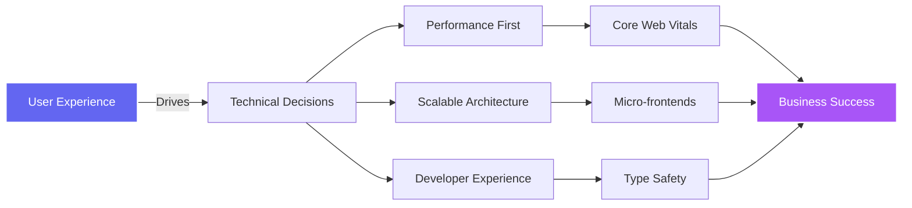

<div align="center">
  
  <!-- Dynamic SVG Header with Animated Gradient -->
  
  
  <!-- Animated Typing with Multiple Lines -->
  

  <!-- Professional Contact Badges -->
  <div>
    
  [](https://girja.co.in)
  [](https://linkedin.com/in/girja-sankar-tiwari)
  [](mailto:tiwarigirjashankar36@gmail.com)
  [](https://girja.co.in/resume)
  
  </div>
</div>

<br/>

<!-- Animated Code Block Showcase -->
<div align="center">
  
</div>

<!-- Animated Wave -->


## 🧬 Technical DNA & Engineering Excellence

```typescript
/**
 * @author Girja Sankar Tiwari
 * @role Senior Frontend Architect
 * @expertise Scalable Financial Systems
 */

class GirjaSankarProfile implements EliteDeveloper {
  private readonly coreCompetencies = {
    languages: ['TypeScript', 'JavaScript ES2024', 'Python', 'GraphQL', 'SQL'],
    
    frontend: {
      frameworks: ['React 18', 'Next.js 14', 'Angular 17'],
      stateManagement: ['Redux Toolkit', 'Zustand', 'TanStack Query', 'RxJS'],
      styling: ['Tailwind CSS', 'CSS-in-JS', 'SCSS Modules', 'Framer Motion'],
      testing: ['Jest', 'React Testing Library', 'Cypress E2E', 'Playwright'],
      performance: ['Code Splitting', 'Lazy Loading', 'Bundle Analysis', 'Web Vitals']
    },
    
    architecture: {
      patterns: ['Micro-frontends', 'Event-Driven', 'Domain-Driven Design', 'SOLID'],
      optimization: ['SSR/SSG', 'ISR', 'Edge Functions', 'CDN Strategy'],
      monitoring: ['Sentry', 'DataDog', 'New Relic', 'OpenTelemetry']
    },
    
    fintech: {
      compliance: ['PCI-DSS', 'GDPR', 'AML/KYC'],
      integrations: ['Banking APIs', 'Payment Gateways', 'Webhook Systems'],
      security: ['OAuth 2.0', 'JWT', 'CSP', 'Rate Limiting']
    }
  };

  public getImpactMetrics(): EngineeringImpact {
    return {
      scale: {
        transactionVolume: '$35 Billion+',
        activeUsers: '3.5 Million+',
        partnersManaged: '250+',
        aumProcessed: '₹4k Crore+'
      },
      performance: {
        pageLoadTime: '<1.2s (p95)',
        apiLatency: '<100ms (p99)',
        bundleSize: '45% reduction',
        uptimeRecord: '99.99%'
      },
      efficiency: {
        automationRate: '70%',
        deploymentFrequency: '15+ per week',
        leadTimeForChanges: '<2 hours',
        mttr: '<30 minutes'
      }
    };
  }
}
```

<div align="center">
  
</div>

## 🎯 Mission-Critical Systems Built

<table>
<tr>
<td width="50%" valign="top">

### 🏦 [Wealthy - Wealth Management Platform](https://wealthy.in)
**Role:** Frontend Developer SDE | **Duration:** June 2024 - Present (1 yr 4 months)

```javascript
const wealthyImpact = {
  // 🎯 Business Impact
  partnersOnboarded: 250,
  aumManaged: '₹4k Crore+',
  automationAchieved: '70%',
  
  // ⚡ Performance Metrics
  onboardingSpeed: '45% faster',
  reportingTime: '-30 hours/month',
  dataAccuracy: '99.9%',
  
  // 🛠️ Technical Excellence
  techStack: [
    'Next.js 14 App Router',
    'GraphQL with Apollo',
    'TanStack Table/Query',
    'TypeScript Strict Mode',
    'Framer Motion'
  ],
  
  // 🏗️ Architectures Implemented
  features: [
    'Real-time hierarchy visualization',
    'Bulk operations system',
    'Advanced analytics dashboard',
    'Role-based access control'
  ]
};
```

**🔥 Key Achievements:**
- Architected micro-frontend CRM handling 10+ hierarchy levels
- Implemented real-time WebSocket updates for live portfolio tracking
- Reduced bundle size by 45% through code-splitting strategies
- Built custom hooks library improving DX across 5 teams

</td>
<td width="50%" valign="top">

### 💳 [Open Financial - B2B Fintech Platform](https://open.money)
**Role:** Frontend Developer | **Duration:** July 2022 - June 2024 (2 years)

```javascript
const openFinancialLegacy = {
  // 💰 Financial Scale
  transactionVolume: '$35 Billion',
  businessesServed: '3.5 Million',
  monthlyPayouts: '$5 Million+',
  
  // 🚀 Performance Gains
  paymentSpeed: '40% faster',
  loanProcessing: '-25% time',
  apiIntegrations: '10+ banks',
  
  // 🏗️ Systems Architected
  modules: [
    'Virtual Banking Accounts',
    'Payment Gateway Hub',
    'Loan Application Engine',
    'Settlement Automation'
  ],
  
  // 🎨 Frontend Excellence
  techUsed: [
    'Angular 17 Standalone',
    'RxJS Reactive Patterns',
    'Module Federation',
    'Web Components'
  ]
};
```

**🎖️ Notable Contributions:**
- Pioneered Angular standalone components reducing build time 35%
- Implemented event-sourcing for transaction history
- Built offline-first PWA for field agents
- Achieved Core Web Vitals green scores across all pages

</td>
</tr>
</table>

<div align="center">
  
</div>

## 📊 Performance & Growth Metrics

<div align="center">
  
  <!-- GitHub Stats with Custom Theme -->
  
  
  
  <!-- Language Stats -->
  
  
</div>

## 🛠️ Technology Mastery Matrix

<div align="center">

| **Category** | **Technologies** | **Proficiency** | **Years** |
|:---:|:---|:---:|:---:|
| **🎨 Frontend Core** | React, Next.js, TypeScript | █████████░ 95% | 4+ |
| **🏗️ Architecture** | Micro-frontends, System Design | ████████░░ 85% | 3+ |
| **📊 State Management** | Redux, Zustand, TanStack Query | █████████░ 90% | 4+ |
| **🎯 Performance** | Web Vitals, Bundle Optimization | █████████░ 92% | 3+ |
| **🧪 Testing** | Jest, RTL, Cypress, Playwright | ████████░░ 80% | 3+ |
| **☁️ Cloud & DevOps** | AWS, Docker, CI/CD, Monitoring | ███████░░░ 75% | 2+ |
| **💳 Fintech** | Payment Systems, Banking APIs | ████████░░ 85% | 2+ |
| **📱 Mobile** | React Native, PWA | ██████░░░░ 65% | 1+ |

</div>

<!-- Animated Divider Line -->


## 🏆 Engineering Philosophy & Principles

<div align="center">
  


</div>

### 🎯 Core Engineering Values

<table>
<tr>
<td width="25%" align="center">

**🚀 Performance**
<br/><br/>
Every millisecond counts. I optimize for Core Web Vitals, implement intelligent caching, and ensure sub-second load times even on 3G networks.

</td>
<td width="25%" align="center">

**🏗️ Scalability**
<br/><br/>
Building systems that grow gracefully from 100 to 10M users. Micro-frontends, edge computing, and horizontal scaling are my tools.

</td>
<td width="25%" align="center">

**🛡️ Reliability**
<br/><br/>
99.99% uptime isn't a goal, it's a baseline. Error boundaries, graceful degradation, and comprehensive monitoring ensure resilience.

</td>
<td width="25%" align="center">

**🧬 Innovation**
<br/><br/>
Staying ahead with React Server Components, Edge Runtime, and WebAssembly. The future of web development is being written today.

</td>
</tr>
</table>

## 🚀 Current Focus & Learning

<!-- Animated Tech Stack Icons -->
<div align="center">
  
  
  
  
  
  
  
  
</div>

```javascript
const currentInitiatives = {
  exploring: {
    'AI Integration': ['Vercel AI SDK', 'LangChain', 'Vector Databases'],
    'Edge Computing': ['Cloudflare Workers', 'Deno Deploy', 'Edge Functions'],
    'Web3': ['Smart Contracts', 'DeFi Protocols', 'Blockchain Integration'],
    'Performance': ['React Compiler', 'Million.js', 'Qwik Framework']
  },
  
  building: {
    'Open Source': 'Contributing to React ecosystem tools',
    'Side Projects': 'AI-powered code review system',
    'Technical Writing': 'Publishing deep-dives on girja.co.in/blog'
  },
  
  certifications: [
    'AWS Certified Developer (In Progress)',
    'Google Cloud Professional (Planned)',
  ]
};
```

## 📈 Impact Visualization

<div align="center">
  
  <!-- Tech Stack Icons -->
  <h3>🛠️ Daily Tech Arsenal</h3>
  
  
  <br/><br/>
  
  <!-- Additional Tools -->
  <h3>🔧 Extended Toolkit</h3>
  
  
</div>

## 🌟 Featured Open Source Contributions

<div align="center">
<table>
<tr>
<td width="50%">
  
[](https://github.com/GIRJASANKAR/video-streaming-platform)

</td>
<td width="50%">

[](https://github.com/GIRJASANKAR/node-jwt)

</td>
</tr>
</table>
</div>

## 💭 Technical Thought Leadership

<div align="center">
  
[](https://girja.co.in/blog)
[](https://girja.co.in)
[](https://linkedin.com/in/girja-sankar-tiwari)

</div>

### 📚 Recent Technical Articles

- 🏗️ **"Micro-Frontend Architecture at Scale"** - How we manage 15+ micro-apps
- ⚡ **"Achieving Sub-Second Load Times in Fintech"** - Performance optimization strategies
- 🔐 **"Building Secure Payment Systems"** - PCI-DSS compliance in modern web apps
- 🎯 **"From 0 to 3.5M Users"** - Scaling frontend infrastructure

## 🤝 Let's Build Something Extraordinary

<div align="center">

I'm passionate about solving complex problems and building products that impact millions. Whether it's optimizing performance, architecting scalable systems, or mentoring teams, I bring a unique blend of technical expertise and business acumen.

### 🎯 Open for Opportunities in:

**Senior Frontend Roles** • **Technical Lead** • **Frontend Architect** • **Staff Engineer**

<br/>

<a href="https://calendly.com/girja">
  
</a>
<a href="mailto:tiwarigirjashankar36@gmail.com">
  
</a>
<a href="https://girja.co.in">
  
</a>

</div>

---

<div align="center">
  
  <!-- Profile Views -->
  
  
  <!-- Trophy Showcase -->
  <br/><br/>
  
  
  <!-- Footer Animation -->
  <br/><br/>
  
  
</div>
